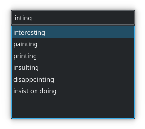

# TextSuggest
### Universal Autocomplete

Autocomplete, text expansion, etc, in all GUI apps (on X11).

TextSuggest supports [multiple languages](#other-languages) and [extensions](#extensions).

<!--**Click the image to view a GIF demo.**-->



Licensed under the [GNU GPL 3](https://www.gnu.org/licenses/gpl.txt). TextSuggest is free as in freedom.

[Acknowledgements for the dictionaries.](#dictionary-credits)

## Overview

TextSuggest is a program that shows completions for the word selected or (optionally) [currently being typed](#auto-selection).

It can be easily bound to a keyboard shortcut.

## Features

Click on these for more info:

<details><summary><b>Fast</b></summary>
<p><br />
TextSuggest is highly performant. Even with large dictionaries of ~30,000 words, it performs a full regex-matching searcj on it in about 0.1 second.
</p>
</details> <br />

<details><summary><b>Universal Autocomplete</b></summary>
<p><br />
TextSuggest can provide autocomplete in any GUI app on X11.
</p>
</details> <br />

<details><summary><b>Text Expansions, and more</b></summary>
<p><br />
TextSuggest can handle a range of expansions.

### Custom words

Simply add them to `~/.config/textsuggest/custom-words.json` in a JSON format like this:

	{
	    "custom": "Expansion",
	    "another": "Another expansion"
	}

and whenever 'custom' is typed, 'Expansion' will be typed. Similarly for 'another' ('Another expansion').

### Commands

Inserts the output of a command:

    $ls -l

when typed into a TextSuggest window, will insert output of `ls -l` as if it was run in a shell.

#### Custom words + Commands

Add in `~/.config/textsuggest/custom-words.json`:

    "custom": "$ command --opts"

and whenever you type 'custom' into TextSuggest, the output of `command --opts` will be inserted.

### Math

Simply type into TextSuggest:

    = 2 + 3

And '5' will be inserted. You can do any math expression that Python supports.

You can also use any function in the Python [`math`](https://docs.python.org/3/library/math.html) library, for example `= sqrt(25)` for √25.

#### Custom Words + Math

Add in `~/.config/textsuggest/custom-words.json`:

    "custom": "= 2 + 3"

And whenever you type 'custom' into TextSuggest, 5 will be inserted.

</p>
</details> <br />


<details><summary><b>Fuzzy Matching</b></summary>
<p><br />
TextSuggest supports very fast and intuitive fuzzy matching, so that you don't have to type the entire word, only portions.

For example, as the screenshot at the top shows, `inting` shows suggestions for `interesting`, `painting` and so on, in order of best match.
</p>
</details> <br />

<details><summary><b>Extensions</b></summary>
<p><br />
TextSuggest supports powerful *processors* for extensions.

A processor *processes* text before handing it over to TextSuggest to type it out.
By default TextSuggest has two processors, [`command`] and [`math_expression`] (see the above *Text Expansions* section).

### Making your own extension

A *processor* is a simple Python script, that *must* define two functions, `matches()` and `process()`. Look into this example:

```python
def matches(text):

	# Return whether this processor should process 'text' or not. (True or False)
	# For example, the command processor has it like this:
	#     return True if text.startswith('$') else False

def process(text):

	# Do something with 'text' and return it.
	# You *must* return a string.
	# This is what will be finally typed.
```

Make one based on the sample above, and place it in `~/.config/textsuggest/processors/` (file must end with `.py` extension).

Processors in `~/.config/textsuggest/processors` take precedence over those in `/usr/share/textsuggest/processors`, in case of a name or match conflict.

You can set the order of loading of processors by creating a file called `load-order.txt` in the processor directory, which should have a newline-separated list of processors. The processors will then load in that order.
</p>
</details> <br />

<details><summary><b>History</b></summary>
<p><br />
TextSuggest supports storing history of suggestions used. More-used suggestions will rise to the top.

History can be disabled using the `--no-history` option.

You can remove a word from history, by pressing <kbd>Shift+Delete</kbd>, or in the file `~/.config/textsuggest/history.json`
</p>
</details> <br />

<details><summary><b>"Ignore" Certain Words</b></summary>
<p><br />
You can tell TextSuggest to *never* show some words conveniently through <kbd>Ctrl+Shift+Delete</kbd>, or in the file `~/.config/textsuggest/ignore.json`.
</p>
</details> <br />

<details><summary><b>Keyboard Shortcuts</b></summary>
<p><br />
While browsing the list of suggestions, press

  - <kbd>Shift+Delete</kbd> to remove it from your history.
  - <kbd>Ctrl+Shift+Delete</kbd> to add it to the ignore list (i.e. will never show up in suggestions)
</p>
</details> <br />

<details><summary><b>Native UI</b></summary>
<p><br />
Unlike many apps, TextSuggest has a performant, entirely native user interface written in Qt 5.

Custom, third-party interfaces can also be easily written.
</p>
</details> <br />

<details><summary><b>Multiple Languages</b></summary>
<p><br />
English and Bangla dictionaries are provided by default.

By default, only the English dictionary will be used.

You can change this by:

  - Auto-detect language from keyboard layout: Use the option `--auto-detect-language`. The mapping of layouts to languages is given below:
    - `bd` → Bangla
    - `us` → English
    - `uk` → English
    - `gb` → English
    - `cn` → Chinese
    - `ar` → Arabic
    - `tw` → Chinese
    - `de` → German
    - `jp` → Japanese
    - `ru` → Russian
    - `es` → Spanish
    - `se` → Swedish
    - `fi` → Finnish
    - `kr` → Korean
    - `pk` → Urdu
    - `fr` → French
    - `gr` → Greek
    - `ua` → Ukrainian

  - Manually specify the language(s) to use. For example, `--language English German`.

TextSuggest will then use `<language name>.txt` file(s) (if they exist) in `/usr/share/textsuggest/dictionaries`.
</p>
</details>


## Installation

Make sure you have all the requirements:

  - `xdotool`
  - `xclip`
  - `PyQt5`
  - `dbus-python` (`pip install dbus-python`)
  - `pyperclip` (`pip install pyperclip`)

Then run the included install script with `sudo ./install.sh`.

**Now, see [Usage](#usage)**


## Usage

Run the command `textsuggest-server` in the background, and set it to run on startup.

Set the command `textsuggest` to a keyboard shortcut. Type a word, select it, press the shortcut and TextSuggest will give you autocomplete.

This offers the most basic use of TextSuggest. For more, see [options](#options) and click on the [features](#features).

## Uninstallation

Use `sudo ./install.sh --uninstall`.

## Options

    $ textsuggest --help
	usage: textsuggest [options]

	TextSuggest — universal autocomplete

	optional arguments:
	  
	  -h, --help            show this help message and exit
	  
	  --word WORD [...]
	                        Specify word to give suggestions for. Default: all words. 
	                         
	  --no-history          Disable the frequently-used words history (stored in ~/.config/textsuggest/history.json) 
	                         
	  --language languages [...]
	                        Set language(s). Default: English. See also: --auto-detect-language. 
	                         
	  --auto-detect-language
	                        Auto-detect language from keyboard layout. 
	                         
	  --selection           Show suggestions for currently selected word. See also: --auto-selection 
	                         
	  --auto-selection [beginning|middle|end]
	                        Automatically select word under cursor and suggest. Ignored if --no-selection. 
	                         
	  --custom-words-only   Show custom words only. 
	                         
	  --no-processing       Disable using of any processors. 
	                         
	  -v, --version         Print version and license information.


## Dictionary Credits

- English:
  Oxford 3k wordlist (filtered to only include words with >= 5 chars)

- Bangla:
  Contributed by @maateen