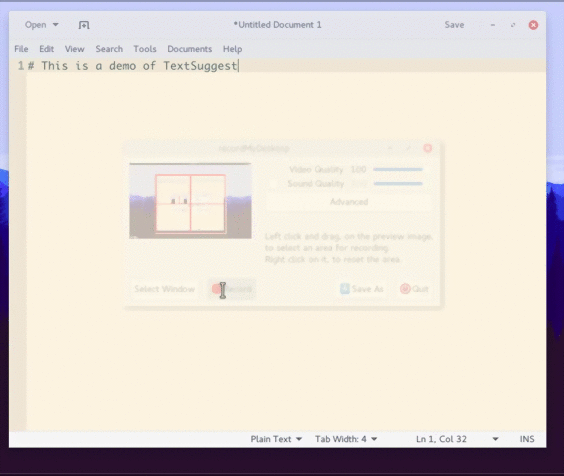

# TextSuggest

**Save keystrokes.** Autocomplete, [expansions](#custom-words) and [more](#expansions) — everywhere.

A utility to autocomplete words in the GUI.

TextSuggest supports [multiple languages](#other-languages) and [extensions](#extensions).

Want to contribute? See [this](CONTRIBUTING.md).

**Click the image to view a GIF demo.**

[](img/demo.gif)

Licensed under the [GNU GPL 3](https://www.gnu.org/licenses/gpl.txt). TextSuggest is free as in freedom.

## Overview

TextSuggest is a script that, when a [keyboard shortcut](#post-install) is pressed, shows completions for the word selected or (optionally) [currently being typed](#auto-selection).

Then you can [efficiently search](#search) for the right word with smart search (thanks to [Rofi](https://github.com/DaveDavenport/Rofi)) and hit Enter to choose. Or Esc to exit.

An [alternative background service, textsuggestd](#textsuggestd) that intelligently offers completions when appropriate, without the need of pressing a shortcut is in development.

## Installation

### Ubuntu and Debian

[Download `textsuggest-git.deb`](https://github.com/bharadwaj-raju/packages/raw/master/TextSuggest/textsuggest-git.deb)

**Now, see [Post-install](#post-install)**

###  Arch Linux

AUR (Arch User Repository): [`textsuggest-git`](https://aur.archlinux.org/packages/textsuggest-git/), submitted by [Daniel Sandman (shellkr)](https://github.com/shellkr)

**Now, see [Post-install](#post-install)**

###  Manual

Make sure you have all the requirements (`xdotool`, `xsel` and `rofi`).

Run the included install script with `sudo ./install.sh`.

**Now, see [Post-install](#post-install)**

### Post-install

Bind the command `textsuggest --auto-selection` to a keyboard shortcut. Type a word, press the shortcut and ... TextSuggest will give you suggestions!

This offers the most basic use of TextSuggest. For more, see [options](#options) and browse through the rest of this page.

### Uninstallation

If you installed it using packages, use your system's package manager.

Otherwise use `sudo ./install.sh --uninstall`.

## Options

Also documented in the manual page: `man textsuggest` and `--help`.

- `-h`, `--help`: Print out a help message.

- `--word word ...`: Specify word to give suggestions for. If not specified, taken from X11 selection. Ignored if `--all-words`.

- `--all-words`: Give *all* the suggestions. Then you can search through them etc.

- `--font font`: Specify font to use for Rofi. Format: FontName (Weight) (Size). Default: Varies based on language.

- `--no-history`: Disable the storage of frequently-used words in `~/.config/textsuggest/history.txt`

- `--language languages ...`: Specify language to use. Appropriate language will be detected if not specified. If detection fails too, English will be used.

- `--auto-selection [beginning|middle|end]`: Auto-select word under cursor and suggest. See [Auto-selection](#auto-selection).

- `--no-processing`: Disable use of [processors](#extensions)

- `--rofi-options options ...`: Specify additional options for Rofi.

- `--exit-if-no-words-found`: Exit if no words are found (`ERR_NOWORDS`, return code 1) instead of restarting in `--all-words` mode (`WARN_NOWORDS`)

- `-v`, `--version`: Print out version and license information.

## Expansions

TextSuggest can handle a range of expansions. It can also be [extended](#extensions).

### Custom words

Simply add them to `~/.config/textsuggest/Custom_Words.txt` like this:

	custom=My custom Expansion!

and whenever 'custom' is typed, 'My custom Expansion!' will be inserted.

### Commands

Inserts the output of a command:

    #ls

when typed into a TextSuggest window, will insert output of `ls`.

#### Custom words + Commands

Add in `~/.config/textsuggest/Custom_Words.txt`:

    custom=#command --opts

and whenever you type 'custom' into TextSuggest, the output of `command --opts` will be inserted.

### Math

Simply type into TextSuggest:

    %2 + 3

And '5' will be inserted. You can do any math expression that Python supports.

You can also use any function in the Python [`math`](https://docs.python.org/3/library/math.html) library, for example `%sqrt(25)` for √25.

#### Custom Words + Math

Add in `~/.config/textsuggest/Custom_Words.txt`:

    custom=%2+3

And whenever you type 'custom' into TextSuggest, 5 will be inserted.

## Extensions

TextSuggest supports powerful *processors* for extensions.

A processor *processes* text before handing it over to TextSuggest to type it out.
By default TextSuggest has two processors, [`command`](#commands) and [`math_expression`](#math).

You can see this in TextSuggest output:

```bash
$ textsuggest --all-words
Running in insert mode.
Chosen word: %2 + 3
Using processor math_expression from /usr/share/textsuggest/processors/math_expression.py
Processed: 5
```

### Making your own extension

A *processor* is a simple Python script, that *must* define two functions, `matches()` and `process()`. Look into this example:

```python
def matches(text):

	# Return whether this processor should process 'text' or not. (True or False)
	# For example, the command processor has it like this:
	#     return True if text.startswith('#') else False

def process(text):

	# Do something with 'text' and return it.
	# You *must* return a string.
	# This is what will be finally typed.
```

Make one based on the sample above, and place it in `~/.config/textsuggest/processors/` (file must end with `.py` extension).

Processors in `~/.config/textsuggest/processors` take precedence over those in `/usr/share/textsuggest/processors`, in case of a name or match conflict.

You can set the order of loading of processors by creating a file called `load-order.txt` in the processor directory, which should have
a newline-separated list of processors. The processors will then load in that order.

## Other languages

English and Bangla dictionaries are provided by default.

For other languages, follow these steps:

- Get a suitable dictionary/wordlist for your language. Search online for "<language name> wordlist" or "<language name> dictionary".

- Put that dictionary into a text file in `/usr/share/textsuggest/dictionaries` with its name being your language's name and extension being `.txt` (English name, like "German.txt" instead of "Deutsch.txt").

- A suitable font should be auto-detected. If not, pass a suitable font with the `--font` option.

- Language should be auto-detected. If not, manually set language using the `--language` option.

## Auto-select and suggest

This feature allows you to get suggestions for the word being typed, without having to select it. Save *more* keystrokes!

### Using it

Pass the `--auto-selection` option to TextSuggest.

#### Additional options

You can change the way `--auto-selection` selects words.

- Add `beginning` to `--auto-selection` to assume that text-cursor is **at beginning of word**.

- Add `middle` to `--auto-selection` to assume that text-cursor is **in the middle of word**.

- Add `end` to `--auto-selection` to assume that text-cursor is **at end of the word**. *This is the default.*

## Search

TextSuggest offers powerful search, thanks to [Rofi](https://github.com/DaveDavenport/Rofi).

It has:

- **Fuzzy search**: No need to type the complete word. Just type parts of it (separated by spaces).
- **Globbing**: Use wildcards like `?`, `*` etc.

## Errors

- `ERR_NOWORDS`: Caused when no suggestions are found. Return value: 1. *NOTE*: Suppressed and program restarted in `--all-words` mode unless
`--exit-if-no-words-found` is passed.

- `ERR_REJECTED`: Caused when TextSuggest is cancelled by user (for example, by pressing `Esc`). Return value: 2.

- `ERR_EXPRESSION`: Caused when evaluating a [math expression](#math) results in a Python error. (Usually `SyntaxError`). Full traceback of said error is writted to stderr. Return value: 3.

## Modes

Internally, TextSuggest has two *modes*:

1. Provides completion for a specific word: `replace` mode.
2. Provides a list of all words: `insert` mode.

You will see this in TextSuggest output:

```bash
$ textsuggest
Running in replace mode.
...
```

## textsuggestd

`textsuggestd` is a work-in-progress background service that automatically launches TextSuggest when appropriate.

It is an effort to achieve TextSuggest's final goal: to be like the suggestions on mobile phones, which appear without stealing focus and disrupting typing, and without having to press shortcuts.

**WARNING**: It is currently unusable. Do *not* run. However, if you want to alpha-test, see below.

### Running textsuggestd

**WARNING**: It is currently unusable. Run at risk. See [escaping](#escaping-textsuggestd).

Simply do:

```bash
$ ./textsuggestd &
```

### Escaping textsuggestd

Get to a terminal somehow (TTY, maybe?) and run:

```bash
for i in $(pgrep python3); do
    ps -fp $i | grep 'textsuggestd' && kill $i
done
```
